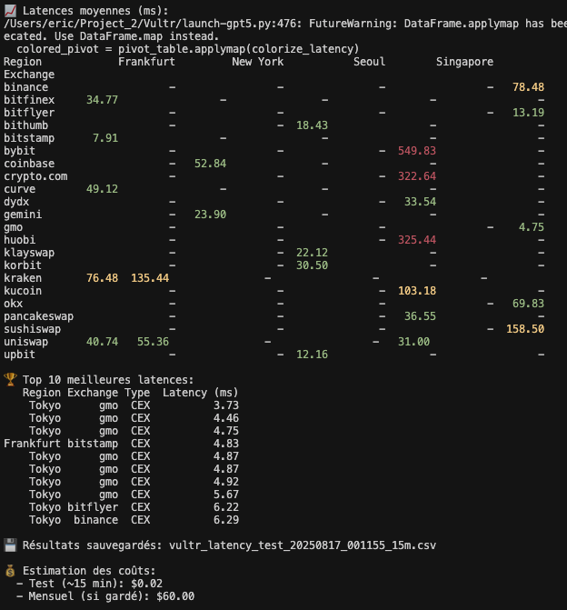
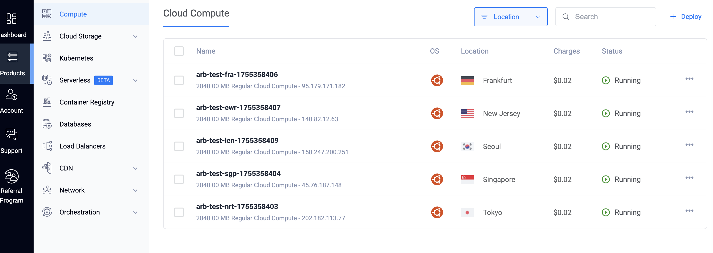
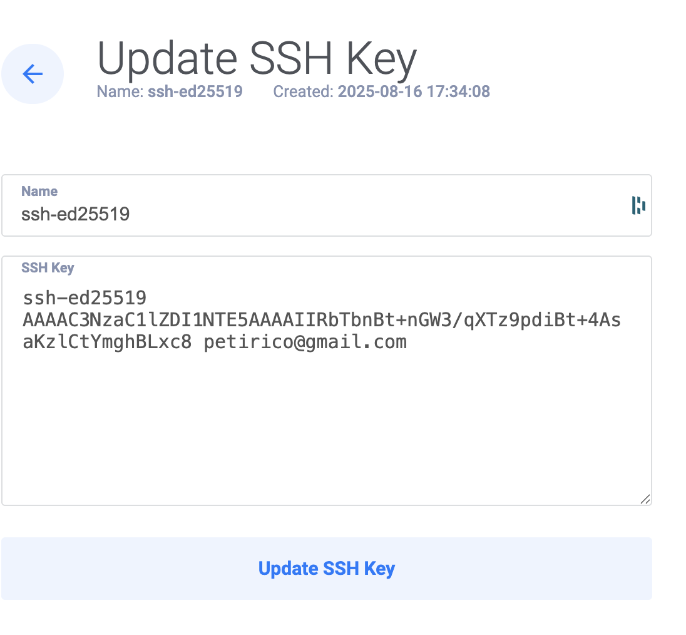

# CEX/DEX Latency measurement with centralization
# Vultr Multi-Region Latency : Orchestration > Deploy > Tester > Aggregator

Measure HTTP latency to popular CEX/DEX endpoints while provisioning short‑lived Vultr instances across multiple regions. The script runs for a selected duration (0 = single pass from each region, 1, 5, 15, or 60 minutes), aggregates results, estimates costs, and prompts to destroy instances (auto‑destroys after 30s if no answer) to avoid unnecessary charges.

## Features
- Multi‑region instance provisioning on Vultr (Cloud Compute `vc2-1c-2gb`, Ubuntu 22.04).
- Latency measurements to curated CEX/DEX endpoints using async HTTP (`aiohttp`).
- Interactive duration selector: 0 (single pass), 1, 5, 15, or 60 minutes (`1h` also accepted).
- Aggregated results (pivot + Top 10) printed to console and saved to CSV.
- Cost estimation proportional to the selected test duration.
- Safe teardown: prompts for destruction and defaults to destroy after 30s of inactivity.
- Structured logging to console and rotating file `latency-multi-geo.log`.
- Colored output for average latencies: < 75 ms (green), 75–200 ms (orange), > 200 ms (red).

## Prerequisites
- Python 3.10+
- A Vultr API key with permissions to create/destroy instances
- macOS/Linux shell (tested on macOS)

## Installation / Setup
1) Create and activate a virtual environment
```bash
python3 -m venv .venv
source .venv/bin/activate
```

2) Install dependencies
```bash
pip install -r requirements.txt
```

3) Configure environment variables
- Create a `.env` file (already git‑ignored) and set your key:
```bash
# .env
VULTR_API_KEY=your-vultr-api-key
```
- Or export it in your shell:
```bash
export VULTR_API_KEY=your-vultr-api-key
```

### SSH key setup (recommended)
To connect to instances without passwords, attach an SSH key at creation time and use your local private key for `ssh/scp`.

1) Generate (if needed) an Ed25519 key pair
```bash
ssh-keygen -t ed25519 -C "you@example.com" -f ~/.ssh/id_ed25519 -N ""
eval "$(ssh-agent -s)" && ssh-add ~/.ssh/id_ed25519
```

Example (your values will differ):
```bash
ssh-keygen -t ed25519 -C "XXXXXXX@gmail.com"
# ... choose ~/.ssh/id_ed25519 (or accept default), set passphrase if desired
cat ~/.ssh/id_ed25519.pub
# -> ssh-ed25519 AAAAC3Nz... petirico@gmail.com  (single line)
```

2) Add the PUBLIC key to Vultr (Account → SSH Keys), then fetch its ID
```bash
export VULTR_API_KEY=your-vultr-api-key
curl -s -H "Authorization: Bearer $VULTR_API_KEY" https://api.vultr.com/v2/ssh-keys \
| python -c 'import sys,json; d=json.load(sys.stdin); [print(k["id"], k["name"]) for k in d.get("ssh_keys", [])]'
```

Example output:
```json
{
  "id": "044d0839-64ae-443b-836a-017fe1776937",
  "name": "ssh-ed25519 "
}
```

3) Configure `.env` for the script
```bash
# Attach the Vultr key ID at instance creation (array supported via comma‑separated list)
VULTR_SSH_KEY_IDS=your-ssh-key-id

# Local private key used by ssh/scp
SSH_KEY_PATH=/Users/you/.ssh/id_ed25519

# Optional fallback: inject a public key via cloud‑init user_data
# (used only if needed; API attachment is preferred)
# SSH_PUBLIC_KEY_PATH=/Users/you/.ssh/id_ed25519.pub
# or
# SSH_PUBLIC_KEY="ssh-ed25519 AAAA... you@example.com"

# Optional SSH waiting/timeout tuning
# SSH_CONNECT_TIMEOUT=30
# SSH_WAIT_RETRIES=20
# SSH_WAIT_DELAY=10
```

4) Verify the key matches
```bash
ssh-keygen -lf ~/.ssh/id_ed25519.pub
ssh -o StrictHostKeyChecking=no -i ~/.ssh/id_ed25519 root@<instance_ip>
```

If the last command connects as `root` without asking for a password, your setup is correct and fully programmatic (no interactive prompts).

## Usage
Run the main script:
```bash
source .venv/bin/activate
python latency-multi-geo.py
```
You will be prompted to choose a duration: `0` (single pass), `1`, `5`, `15`, or `60` minutes (`1h` also accepted). The script will:
- Create instances in default regions: Tokyo (`nrt`), Singapore (`sgp`), Frankfurt (`fra`), New York (`ewr`), Seoul (`icn`).
- Wait for instances to become active.
- Perform repeated latency measurements during the selected time window.
- Print a pivot table and Top 10 latencies.
- Save results to a timestamped CSV file: `vultr_latency_test_YYYYMMDD_HHMMSS_<duration>m.csv`.
- Estimate the test cost and ask whether to destroy instances.
  - If you do not answer within 30 seconds, instances are destroyed automatically.

## Output
- CSV: `vultr_latency_test_<timestamp>_<duration>m.csv`
- Log file: `latency-multi-geo.log` (rotating)
- Console summary: pivot table (average latency per region) and Top‑10 best latencies

### Preview





SSH key saved in Vultr UI:



## Billing Notes (Vultr)
- Instances are billed hourly/minute with a monthly cap. There is no long‑term commitment.
- Stopped instances still incur charges; only destroying them stops billing.
- This project prompts for teardown and destroys instances automatically after 30s if unattended.

## Configuration
- Regions: update `regions_to_deploy` in `latency-multi-geo.py` (default: `nrt`, `sgp`, `fra`, `ewr`, `icn`).
- Plan/OS: `VULTR_PLAN_ID = "vc2-1c-2gb"`, `VULTR_OS_ID = 1743` (Ubuntu 22.04).
- Endpoints: see `REGION_EXCHANGE_MAP` inside `latency-multi-geo.py`.
- Measurement interval: currently 30 seconds between iterations.

## Troubleshooting
- 400 Invalid user_data (check base64 encoding): The script encodes `user_data` in Base64 as required. If it persists, verify your API key and account permissions.
- Permission denied (publickey,password): Ensure your Vultr SSH key is attached (`VULTR_SSH_KEY_IDS`) and your local private key path is set (`SSH_KEY_PATH`). Recreate instances after fixing keys.
- SSH not ready / timeouts: Increase `SSH_WAIT_RETRIES`/`SSH_WAIT_DELAY` or `SSH_CONNECT_TIMEOUT`. Ensure no firewall blocks port 22.
- Permission errors on API: Ensure the API key is active and authorized for instance create/delete.
- No results saved: If the measurement window completes without successful requests, the script will print a warning and skip CSV output.

## Certificates / Verification
- HTTPS calls use `requests`/`aiohttp` default certificate validation. If you need custom CAs or to disable verification temporarily, adapt the client session accordingly.
- SSH host keys are accepted with `StrictHostKeyChecking=no` for automation; tighten this for production by managing `known_hosts`.

## Security
- Secrets are stored in `.env` which is listed in `.gitignore`.
- Never commit API keys to version control.

## License
This project is provided as‑is for demonstration and testing purposes. Review and adapt before production use.
